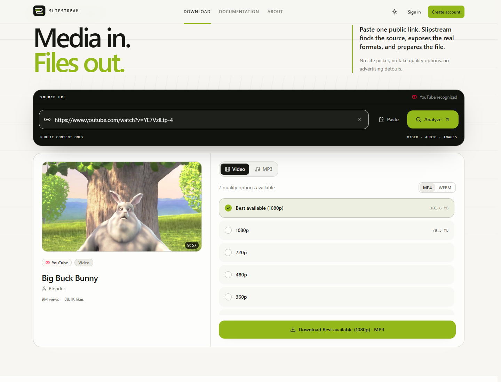
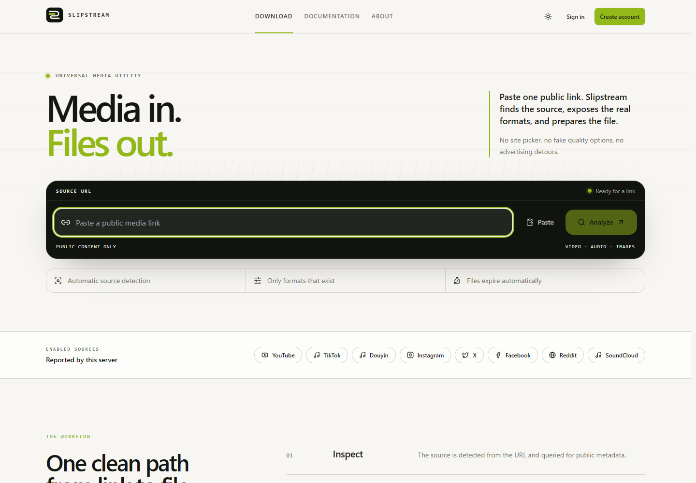
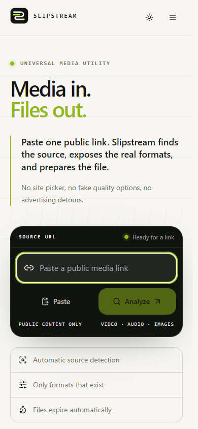

<p align="center">
  
</p>

<h1 align="center">Slipstream</h1>

<p align="center">
  <strong>Media in. Files out.</strong><br />
  A precise, self-hosted downloader for publicly accessible media.
</p>

<p align="center">
  <a href="https://github.com/SonyDew/slipstream/actions/workflows/backend.yml"></a>
  <a href="https://github.com/SonyDew/slipstream/actions/workflows/frontend.yml"></a>
  <a href="LICENSE"></a>
  
  
</p>

<p align="center">
  
</p>

Slipstream turns one public media URL into the formats that actually exist for that item.
It does not invent quality options, upscale audio, hide work behind fake progress, or route
users through advertising pages. The React application and FastAPI service ship together
as a single self-hostable product.

## Product

<p align="center">
  
</p>

<table>
  <tr>
    <td width="72%"></td>
    <td width="28%"></td>
  </tr>
  <tr>
    <td align="center"><sub>Desktop — downloader in the first viewport</sub></td>
    <td align="center"><sub>Mobile — purpose-built responsive layout</sub></td>
  </tr>
</table>

### What makes it different

- **Honest formats.** Resolution and bitrate options come from the extractor result for
  the exact URL. Missing formats are never advertised.
- **A complete download flow.** URL detection, metadata, thumbnail, video/audio choice,
  quality selection, queued processing, live progress, completion and failures are all
  first-class states.
- **Public media only.** No DRM circumvention, paywall bypass, private-account access,
  CAPTCHA solving, cookie injection or age-gate defeat.
- **Operational by default.** Authentication, account history, an admin workspace,
  rate limits, temporary-file expiry, health checks and audit records are included.
- **One origin.** The production build serves the SPA and `/api/*` from the same host,
  keeping deployment and cookie security straightforward.

## Platform status

The dedicated providers below were smoke-tested with real public URLs on **29 August
2026**. Platform extraction is inherently changeable; keep yt-dlp current and consult the
health endpoint when operating a public instance.

| Source | Analyze | Download | Notes |
| --- | :---: | :---: | --- |
| YouTube | ✓ | ✓ | Video and MP3; FFmpeg merges split streams |
| TikTok | ✓ | ✓ | Video and photo-post handling |
| Douyin | ✓ | ✓ | Browser fallback for public pages when extraction is blocked |
| Instagram | ✓ | ✓ | Public posts, reels and video |
| X / Twitter | ✓ | ✓ | Public posts containing media |
| Facebook | ✓ | ✓ | Public video pages; some page shapes remain upstream-dependent |
| Reddit | ✓ | ✓ | Reddit-hosted public media |
| SoundCloud | ✓ | ✓ | Audio-first presentation and MP3 output |
| Direct media URL | ✓ | ✓ | Guarded generic fallback for supported public URLs |
| Vimeo | — | — | Recognized but not advertised while anonymous extraction is blocked upstream |

Slipstream also has a guarded generic yt-dlp fallback. That is compatibility, not a claim
that every yt-dlp extractor is continuously tested here.

## Quick start

### Docker Compose

```bash
git clone https://github.com/SonyDew/slipstream.git
cd slipstream
cp .env.example .env
# Edit .env and set SECRET_KEY plus INITIAL_ADMIN_PASSWORD before starting.
docker compose up --build -d
```

Review `.env` before exposing the instance. At minimum, set a strong `SECRET_KEY`, set
`ENVIRONMENT=production`, choose a strong `INITIAL_ADMIN_PASSWORD`, and terminate TLS at
the included nginx layer or your own reverse proxy.

### Local development

Requires Python 3.11+, Node 20+ and FFmpeg on `PATH`.

```bash
# backend
cd backend
python -m venv .venv
# Activate it: .\.venv\Scripts\Activate.ps1 on Windows,
# or: source .venv/bin/activate on Linux/macOS.
python -m pip install -r requirements.txt -r requirements-dev.txt
python -m uvicorn app.main:app --reload --port 8000

# frontend, in a second terminal
cd frontend
npm install
npm run dev
```

Vite runs on port `5173` and proxies `/api` to the backend. For the production-shaped
single-origin build:

```bash
npm --prefix frontend run build
cd backend
python -m uvicorn app.main:app --port 8000
```

The application is then available at `http://127.0.0.1:8000`; OpenAPI is served at
`/api/docs`.

## Architecture

```text
Browser
  ├── React + TypeScript SPA
  │     └── URL → metadata → real formats → job progress → file
  └── /api/*
        └── FastAPI
              ├── provider registry → yt-dlp / public browser fallback
              ├── bounded worker queue → FFmpeg
              ├── session auth + CSRF + rate limiting
              └── SQLAlchemy + SQLite WAL + temporary storage
```

- **Backend:** FastAPI, Pydantic v2, SQLAlchemy 2, Alembic, yt-dlp, curl-cffi,
  Playwright and FFmpeg.
- **Frontend:** React 18, TypeScript, Vite, Tailwind, react-router-dom and lazy-loaded
  Recharts for the admin workspace.
- **Delivery:** Docker images for amd64 and arm64, Compose profiles, nginx and native
  Windows/Ubuntu setup guides.

Read [the architecture notes](docs/ARCHITECTURE.md) for boundaries, data flow and design
decisions.

## Configuration and operation

Runtime settings such as registration, guest downloads, allowed platforms, file and
duration ceilings, maintenance mode and rate limits can be changed in the admin UI
without restarting the server.

```bash
cd backend
.venv/Scripts/python -m app.cli verify
.venv/Scripts/python -m app.cli create-admin --username alice --email alice@example.com
.venv/Scripts/python -m app.cli stats
.venv/Scripts/python -m app.cli cleanup
```

All mutable runtime data lives under `data/` and is excluded from version control. See
[deployment](docs/DEPLOYMENT.md), [backups](docs/BACKUPS.md),
[updates](docs/UPDATES.md) and [troubleshooting](docs/TROUBLESHOOTING.md) before operating
an internet-facing instance.

## Quality gates

```bash
cd backend
.venv/Scripts/python -m ruff check .
.venv/Scripts/python -m ruff format --check .
.venv/Scripts/python -m mypy app
.venv/Scripts/python -m pytest -q

cd ../frontend
npm run typecheck
npm run lint
npm run build
```

The current backend suite contains **324 passing tests and 1 intentional skip**.

## Documentation

| Guide | Purpose |
| --- | --- |
| [API](docs/API.md) | Endpoints, response shapes and stable error codes |
| [Development](docs/DEVELOPMENT.md) | Local setup and development loop |
| [Deployment](docs/DEPLOYMENT.md) | Docker, systemd, reverse proxy and sizing |
| [Windows](docs/WINDOWS.md) | Native Windows setup |
| [Ubuntu](docs/UBUNTU.md) | Native Ubuntu deployment |
| [Oracle ARM64](docs/ORACLE.md) | Always-Free ARM64 profile |
| [Security](SECURITY.md) | Vulnerability reporting and operator hardening |
| [Contributing](CONTRIBUTING.md) | Project scope, invariants and pull-request checks |

## Licence and identity

The source code is licensed under the **GNU Affero General Public License v3.0 or
later**. You may use, study, modify and redistribute it under the AGPL. Modified network
services must offer their corresponding source to their users, and copyright/licence
notices must remain intact. See [LICENSE](LICENSE) and [NOTICE](NOTICE).

The Slipstream name and visual identity are separate from the source-code licence. Forks
are welcome, but they must not imply that they are official Slipstream releases. See
[TRADEMARKS.md](TRADEMARKS.md).

Slipstream retrieves media that the operator and user are entitled to retrieve. Users are
responsible for complying with source-platform terms and applicable copyright law. The
project does not host, index or redistribute third-party media.
